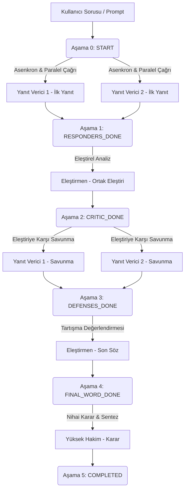

# LLM Ensemble (Yerel Tartışma Arenası)

[](https://www.python.org/)
[](https://www.riverbankcomputing.com/software/pyqt/)
[](https://opentelemetry.io/)
[](https://github.com/astral-sh/uv)

Bu proje, yerel yapay zeka modellerinin (**Ollama** aracılığıyla) koordineli ve paralel çalışarak çok aşamalı tartışmalar yürütmesini sağlayan **Multi-Agent Ensemble (Çoklu Ajan İş Birliği)** sistemidir. Hem **Grafik Arayüz (GUI)** hem de **Komut Satırı (CLI)** desteğine sahip olan bu arena, bağımsız ajanların birbirini eleştirdiği, savunduğu ve nihai olarak bağımsız bir hakim modeli tarafından değerlendirildiği otonom bir akış sunar.

---

## 🗺️ Tartışma İş Akışı (Workflow)

Tartışma akışı otonom olarak toplamda **6 aşamadan (`Stage`)** oluşmaktadır:



1. **Aşama 0 (STARTED):** Kullanıcı promptu alınır. **Yanıt Vericiler** asenkron olarak çalışarak ilk cevaplarını üretir.
2. **Aşama 1 (RESPONDERS_DONE):** **Eleştirmen** iki yanıtı karşılaştırarak tarafsız bir eleştiri raporu yazar.
3. **Aşama 2 (CRITIC_DONE):** **Yanıt Vericiler** eleştirilere karşı kendi tezlerini savunan ikinci yanıtı (savunma) hazırlar.
4. **Aşama 3 (DEFENSES_DONE):** **Eleştirmen** savunmaları okuyarak tartışmanın gidişatını özetleyen son sözünü söyler.
5. **Aşama 4 (FINAL_WORD_DONE):** **Yüksek Hakim** tüm süreci (cevaplar, eleştiriler, savunmalar, son söz) inceler ve en başarılı yanıtı seçerek nihai sentez kararını açıklar.
6. **Aşama 5 (COMPLETED):** Konuşma tamamlanır ve yerel SQLite veritabanına kaydedilir.

---

## ⚡ Öne Çıkan Gelişmiş Özellikler

### 🔍 Agresif Gözlemlenebilirlik & Telemetry (Aggressive Tracing)
Uygulama içinde harici bir Docker (Jaeger/Langfuse/Phoenix) backend ihtiyacı gerektirmeden çalışan, tamamen çevrimdışı (offline) ve self-contained bir OpenTelemetry izleme altyapısı mevcuttur:
- **Zengin Bağlam Öznitelikleri (Context Enrichment)**: LLM çağrılarındaki `system_prompt`, `user_prompt`, `temperature` parametreleri otomatik olarak yakalanır. Stream çağrılarında tüm chunk'lar birleştirilerek tek bir `raw_response` olarak span'e kaydedilir.
- **Kesin Token ve Performans Ölçümleri**: Ollama istatistiklerinden `prompt_tokens`, `completion_tokens` ve `total_tokens` değerleri çıkarılır. TTFT (Time to First Token) ve TPS (Tokens Per Second) kesin olarak hesaplanır.
- **Donanım ve Zaman Profilleme**: Python overhead süresi (`python_overhead_ms`) ile model çıkarım süresi net olarak ayrıştırılır. Intel Arc Graphics GPU, Vulkan ve DirectML backend kullanımı profillenerek span özniteliklerine yansıtılır. Sistem RAM (Total/Free) ve VRAM limitleri event olarak span'e eklenir.
- **Child Spans (Alt İzler)**: SQLite sorguları (`sqlite_write`), dosya I/O ve MCP çağrıları kendi alt-span'leri (Child Span) ile sarmalanır.
- **Derin Hata Yakalama (Exception local variable tracking)**: Hata durumunda sadece stack trace değil, exception fırlatıldığı frame'deki tüm kritik yerel değişken durumları (`f_locals`) otomatik olarak span özniteliklerine işlenir.

### 💻 Split-View Görsel Telemetry İzleyici (PyQt5)
Arayüze yerleştirilen `📊 Telemetry` butonu ile açılan panelde:
- **Üst Kısım**: Trace hiyerarşisi (ana konuşma, ajan aşamaları, API çağrıları, SQLite sorguları) parent-child ağaç yapısında listelenir. Başarılı adımlar yeşil (`#81c784`), hatalar kırmızı (`#ff5252`) olarak renklendirilir.
- **Alt Kısım**: Seçilen span'in tüm detayları (donanım süreleri, promptlar, donanım backend durumları, model yapılandırması ve hata anındaki lokal değişkenler) zengin HTML formatında listelenir.

### ⏸️ Mola Ver ve Devam Et (Pause / Resume)
Ajan akışını bozmadan uzun LLM üretimlerinde **"Mola Ver"** seçeneği kullanılabilir. Sistem o anki adım biter bitmez tüm tartışma geçmişini veritabanına kümülatif olarak kaydeder. Uygulama kapatılsa dahi veritabanından state okunarak tartışma kaldığı aşamadan hiçbir veri kaybı olmadan sürdürülür.

### ⚙️ Temiz Mimari ve Donanım Desteği
- Proje **Clean Architecture** prensiplerine göre yapılandırılmıştır:
  - `api/`: Ollama ile asenkron / streaming iletişimi yönetir (`tenacity` yeniden deneme mekanizması).
  - `core/`: İş mantığı ve ajan süreçlerini SOLID prensiplerine uygun yönetir. Telemetry kodları iş mantığına sızmaz, `@trace_tool_execution` decorator ve context manager'ları üzerinden temizce sarmalanır.
  - `db/`: SQLite işlemlerini kuyruk tabanlı bağımsız bir yazma thread'i ile yürüterek kilitlenmeleri önler.
- Yerel donanım tarafında **OpenVINO**, **Vulkan** ve **DirectML** entegrasyonlarıyla Intel AI Boost NPU ve Intel Arc GPU mimarilerinde maksimum çıkarım hızı elde edilir.

---

## 📁 Proje Klasör Yapısı

*   `api/` - [api_manager.py](file:///c:/Projects/llm_ensemble-kimi-ollama-ver/api/api_manager.py): Ollama API ile asenkron akışlı ve senkron iletişimi yönetir.
*   `core/`
    *   [conversation_manager.py](file:///c:/Projects/llm_ensemble-kimi-ollama-ver/core/conversation_manager.py): Tartışmanın mantıksal iş akışını kontrol eder.
    *   [telemetry.py](file:///c:/Projects/llm_ensemble-kimi-ollama-ver/core/telemetry.py): Agresif telemetri, monkey-patching ve donanım algılama servisleri.
*   `db/` - [database_manager.py](file:///c:/Projects/llm_ensemble-kimi-ollama-ver/db/database_manager.py): SQLite (`llm_challenger.db`) thread-safe arka plan yazma kuyruğu.
*   [gui.py](file:///c:/Projects/llm_ensemble-kimi-ollama-ver/gui.py): PyQt5 ile yazılmış, split-view telemetry konsolunu barındıran grafik arayüz.
*   [main_cli.py](file:///c:/Projects/llm_ensemble-kimi-ollama-ver/main_cli.py): Komut satırı test arayüzü.
*   `tests/` - Entegrasyon ve telemetri birim testleri.

---

## 🛠️ Kurulum ve Çalıştırma

Projede Rust tabanlı son derece hızlı Python paket yöneticisi **uv** kullanılması tavsiye edilir.

### 1. Gereksinimler
- Bilgisayarınızda **Ollama** kurulu ve çalışır durumda olmalıdır.
- Tercihen sisteminizde yüklü bir yerel model bulunmalıdır (Örn: `gemma4:26B-32K` veya `qwen2.5:latest`).

### 2. Ortam Hazırlama ve uv ile Kurulum
```powershell
# 1. uv yüklü değilse kurun (PowerShell)
powershell -c "irm https://astral.sh/uv/install.ps1 | iex"

# 2. Proje dizininde sanal ortam oluşturun ve bağımlılıkları yükleyin
uv venv
uv pip install -r requirements.txt
```

### 3. Uygulamayı Başlatma
*   **Grafik Arayüz (GUI):**
    ```powershell
    .venv\Scripts\python gui.py
    ```
*   **Komut Satırı (CLI):**
    ```powershell
    .venv\Scripts\python main_cli.py
    ```

---

## 🧪 Testleri Çalıştırma

Asenkron akışları, veritabanı işlemlerini, telemetry decorator ve context manager'larını doğrulayan birim testleri çalıştırmak için:

```powershell
.venv\Scripts\python -m pytest
```

---

## 🐳 Docker ile Çalıştırma

Tartışma arenası uygulamasını ve yerel Ollama servisini tamamen izole bir konteyner ağı üzerinde ayağa kaldırmak için:

```bash
docker-compose up --build
```
Uygulama etkileşimli (`stdin_open: true`) olarak başlatıldığı için terminal üzerinden tartışmayı yönetebilirsiniz.
