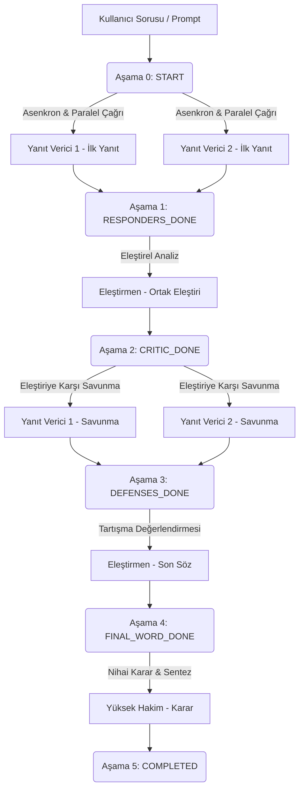

# LLM Ensemble (Yerel Tartışma Arenası) Projesi

Bu proje, yerel yapay zeka modellerinin (**Ollama** aracılığıyla) koordineli bir şekilde çalışarak çok aşamalı bir tartışma yapmasını sağlayan, hem **Komut Satırı (CLI)** hem de **Grafik Arayüz (GUI)** desteğine sahip bir **Multi-Agent Ensemble (Çoklu Ajan İş Birliği)** sistemidir.

Projenin temel amacı; tek bir LLM'in yanıtı yerine, birden fazla modelin birbirinin yanıtını analiz etmesi, eleştirmesi, savunması ve nihai olarak bağımsız bir hakim modeli tarafından değerlendirilmesi sonucu en doğru ve tarafsız cevaba ulaşmaktır.

---

## 🗺️ Tartışma İş Akışı (Workflow)

Sistemdeki tartışma akışı toplamda **6 aşamadan (`Stage`)** oluşur ve aşağıdaki gibi işler:



### Aşama Detayları
1.  **Aşama 0 (STARTED):** Kullanıcı sorusu alınır. **Yanıt Verici 1** ve **Yanıt Verici 2** modelleri asenkron olarak çalışarak ilk cevaplarını üretir.
2.  **Aşama 1 (RESPONDERS_DONE):** **Eleştirmen** modeli iki yanıtı da karşılaştırarak güçlü ve zayıf yönlerini ortaya koyan bir eleştiri raporu yazar.
3.  **Aşama 2 (CRITIC_DONE):** **Yanıt Vericiler**, eleştirmenin raporuna karşı kendi tezlerini savunan ikinci birer yanıt (savunma) hazırlar.
4.  **Aşama 3 (DEFENSES_DONE):** **Eleştirmen** savunmaları okuyarak tartışmanın gidişatını özetleyen son sözünü söyler.
5.  **Aşama 4 (FINAL_WORD_DONE):** **Yüksek Hakim** tüm süreci (ilk cevaplar, eleştiriler, savunmalar, son söz) inceler ve en başarılı yanıtı seçerek nihai sentez kararını açıklar.
6.  **Aşama 5 (COMPLETED):** Konuşma tamamlanır ve veritabanına kaydedilir.

---

## 📁 Proje Klasör Yapısı

*   `api/`
    *   [api_manager.py](file:///c:/Projects/llm_ensemble-kimi-ollama-ver/api/api_manager.py): Ollama yerel sunucusu ile asenkron (akışlı/streaming) ve senkron iletişimi yönetir. Başarısız bağlantı denemeleri için `tenacity` ile otomatik yeniden deneme yapar.
*   `core/`
    *   [conversation_manager.py](file:///c:/Projects/llm_ensemble-kimi-ollama-ver/core/conversation_manager.py): Tartışmanın mantıksal iş akışını kontrol eder. Aşamalar arası veri geçişlerini yönetir ve duraklatma/devam etme durumlarını kontrol eder.
*   `db/`
    *   [database_manager.py](file:///c:/Projects/llm_ensemble-kimi-ollama-ver/db/database_manager.py): SQLite (`llm_challenger.db`) işlemlerini yürütür. SQLite kilitlenmelerini önlemek için arka planda bağımsız bir yazma kuyruğu thread'i barındırır.
*   [gui.py](file:///c:/Projects/llm_ensemble-kimi-ollama-ver/gui.py): PyQt5 ile yazılmış, Markdown destekli, tartışmanın canlı akışının takip edilebildiği grafik arayüz.
*   [main_cli.py](file:///c:/Projects/llm_ensemble-kimi-ollama-ver/main_cli.py): Komut satırı üzerinden çalışan ve sonuçları Pandas tablosu olarak yazdıran test arayüzü.
*   `requirements.txt`: Gerekli Python paketlerinin listesi.
*   `.env`: Çevre değişkenleri (`OLLAMA_HOST`).

---

## 💾 Veritabanı Şeması (SQLite)

Veritabanında 3 temel tablo barındırılır:
1.  **`conversations`:** Konuşmanın genel durumu, kullanılan modeller, aşama bilgisi ve duraklatıldıysa o ana kadarki tüm verileri (`state_data`) tutar.
2.  **`prompts`:** Modellere gönderilen tüm ara sistem prompt'larını tarih bilgisiyle kaydeder.
3.  **`responses`:** Modellerin ürettiği her bir cevabı türlerine göre (`yanıt`, `eleştiri`, `savunma`, `son_söz`, `karar`) gruplayarak saklar.

---

## ⚡ Temel Özellikler

### ⏸️ Mola Ver ve Devam Et (Pause / Resume)
Tartışma sırasında bir LLM'in uzun yanıt üretmesini beklemek istemediğinizde **"Mola Ver"** butonuna basabilirsiniz. Sistem o anki adım biter bitmez tüm tartışma geçmişini veritabanına kümülatif olarak kaydeder ve durur. Uygulamayı kapatıp açsanız dahi **"Devam Et"** butonu aktifleşir ve kaldığı aşamadan hiçbir veri kaybı olmadan tartışmayı sürdürür.

### 🧵 Thread-Safe Veritabanı Yazıcısı
GUI ve asenkron arka plan işlemleri sırasında veritabanı kilitlenmelerini önlemek adına tüm yazma (`INSERT`/`UPDATE`) istekleri bir kuyruğa (`Queue`) alınır ve arka plandaki özel bir işçi thread (`_process_writes`) tarafından sırayla işlenir.

---

## 🛠️ Kurulum ve Çalıştırma

### 1. Gereksinimler
Bilgisayarınızda **Ollama** kurulu ve çalışır durumda olmalıdır.

### 2. Sanal Ortam Oluşturma ve Kütüphane Kurulumu
Proje dizininde terminali açıp aşağıdaki adımları uygulayın:

```powershell
# 1. Sanal ortamı oluşturun
python -m venv .venv

# 2. Sanal ortamı aktifleştirin (PowerShell için)
.venv\Scripts\Activate.ps1

# 3. Kütüphaneleri kurun
pip install -r requirements.txt
```

### 3. Çalıştırma

*   **Grafik Arayüz (GUI) Uygulaması:**
    ```powershell
    python gui.py
    ```

*   **Komut Satırı (CLI) Uygulaması:**
    ```powershell
    python main_cli.py
    ```

---

## 🧪 Testleri Çalıştırma

Projede asenkron akışları ve veritabanı işlemlerini izole ederek doğrulayan entegrasyon testleri mevcuttur. Sanal ortam aktifken testleri çalıştırmak için:

```powershell
pytest
```

---

## 🐳 Docker ile Çalıştırma

Tartışma arenası uygulamasını ve yerel Ollama servisini tamamen izole bir konteyner ağı üzerinde ayağa kaldırmak için Docker ve Docker Compose kullanabilirsiniz.

### 1. Docker Yapılandırması
`.env` dosyanızı oluşturun (Örn: `.env.example` dosyasını `.env` olarak kopyalayabilirsiniz).

### 2. Konteynerleri Başlatma
```bash
docker-compose up --build
```
Bu komut hem Ollama API servisini hem de Python CLI uygulamasını (`debate_app`) ayağa kaldıracaktır. Uygulama etkileşimli (`stdin_open: true`) olarak başlatıldığı için terminal üzerinden girdi verip tartışmayı yönetebilirsiniz.
